# Java basic

<section class="section">
  
[마인드맵링크](https://boardmix.com/app/editor/AYsxhDpde05OEJua4Z55Ug</a>

  

    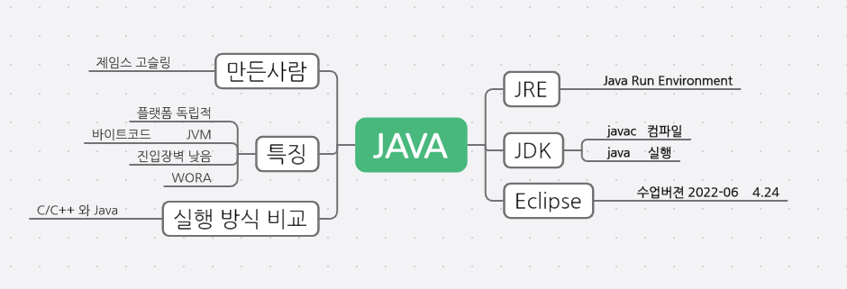
  

  <h2>JAVA - JVM,JDK,JRE</h2>
  <h4>JVM,JDK,JRE에 대해서 알아보기</h4>
  

    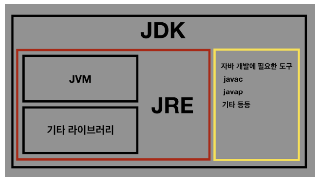
  

  <h4>JVM (Java Virtual Machine)</h4>
  
자바 가상 머신 의 약자로 자바 바이트 코드를 실행시키기 위한 가상 머신이다. 자바는 이 JVM 덕분에 플랫폼에 독립적일 수 있다.

  <h4>JRE (Java Runtime Environment)</h4>
  
자바 실행 환경의 약자로 자바 프로그램을 실행하기 위한 도구들이 들어있으며 JVM이 이 안에 포함된다.

  <h4>JDK (Java Development Kit)</h4>
  
자바 개발 도구의 약자로 자바로 개발을 하기 위한 모든 것을 묶어놓은 키트이다. 자바 실행 환경과 기타 개발 도구로 구성된다.

</section>

  <h2>✨[Java] JVM과 GC 메모리 관리</h2>
  <h3>💡 JVM(Java Virtual Machine, 자바가상머신)</h3>
  
OS의 메모리 영역에 접근하여 메모리를 관리하는 프로그램으로, 메모리관리와 Garbage Collecting 기능을 수행한다.

  <h3>💡 GC(Garbage Collector, 가비지 컬렉터)</h3>
  
동적으로 할당한 메모리 영역 중 사용하지 않는 영역을 탐지하여 해제하는 기능을 수행한다.

  <h3>💡 Garbage Collecting 과정</h3>
  
Heap 영역에서 더 이상 사용되지 않는 오브젝트를 찾아, 가비지 컬렉션을 담당하는 프로세스가 자동으로 메모리에서 제거한다.

  <h4><u>✔ Stack과 heap</u></h4>
  
<strong><em>🎁 Stack : </em></strong>정적으로 할당한 메모리 영역 <strong><u>원시타입</u></strong>의 데이터가 값과 함께 할당된다. Heap 영역에 생성된 오브젝트 타입 데이터의 참조값이 할당된다.

  
<strong><em>🎁 Heap : </em></strong>동적으로 할당한 메모리 영역 , <strong><u>모든 오브젝트 타입의 데이터</u></strong>가 할당된다.

  <h4><u>✔ Runtime시 stack과 heap에 메모리 할당</u></h4>
  

    
  

  
원시 타입의 데이터의 경우 변수와 값이 모두 <u>Stack에 저장</u>

  
오브젝트 타입인 String형 데이터는 <u>변수(참조값)는 Stack에 값(실제값)은 heap에 저장</u>

  <h4><u>✔ 사용종료시</u></h4>
  
실행이 종료되면 Stack에 할당되었던 데이터는 삭제  하지만, heap영역에 할당된 데이터는 삭제되지 않고 남아있고, 이것을 <b>Unreachable Object</b> 라고 부른다.  ※ Unreachable Object : Heap 영역의 오브젝트 중 Stack에서 도달 불가능한 오브젝트들은 가비지 컬렉션의 대상이된다.

  <h4><u>✔ GC 처리과정</u></h4>
  
<strong><em>🎁 Mark : </strong></em>Garbage collector가 stack의 모든 변수를 스캔하며, 각각 어떤 객체를 참조하고 있는지 찾아 마킹  Reachable Object가 참조하고 있는 객체도 찾아서 마킹

  
<strong><em>🎁 Sweep : </strong></em>마킹되지 않은 객체를 Heap에서 제거

  <h4><u>✔ GC의 메모리 관리과정</u></h4>
  
<strong><em>🎁 Eden -> Survivor : </strong></em>Object가 생성되면, Eden 역역에 최초로 할당   Eden 영역의 메모리가 꽉차면, Object의 참조여부를 따져서 이동. stack에 참조가 되어있는 Reachable Object(Live Object)인 경우, Survivor영역으로 넘김 stack에 참조가 되어있지 않은 Unreachable Object인 경우, 그냥 남겨 놓음  Object이동이 끝나면, Eden 영역을 모두 청소

</section>

  <h3>출력 - println()</h3>
  
println은 자바에서의 기본 출력문으로 가장 많이 사용되며 출력하고 싶은 내용 그대로를 입력하여 출력한다.

  <h3>형식화된 출력 - printf()</h3>
  
지시자를 통해 변수의 값을 여러 가지 형식으로 변환하여 출력할 수 있다.

  
System.out.printf<strong>("출력 서식", 출력할내용);</strong>

  <table>
    <th>지시자</th>
    <th>설명</th>
      <tr>
        <td>%b</td>
        <td>boolean 형식으로 출력 </td>
      </tr>
      <tr>
        <td>%d</td>
        <td>정수 형식으로 출력</td>
      </tr>
      <tr>
        <td>%o</td>
        <td>8진수 정수의 형식으로 출력</td>
      </tr>
      <tr>
        <td>%x 또는 %X</td>
        <td>16진수 정수의 형식으로 출력</td>
      </tr>
      <tr>
        <td>%f</td>
        <td>문자형식으로 출력 </td>
      </tr>
      <tr>
        <td>%c</td>
        <td>문자열 형식으로 출력</td>
      </tr>
      <tr>
        <td>%n</td>
        <td>줄바꿈 기능</td>
      </tr>
      <tr>
        <td>%e 또는 %E</td>
        <td>지수 표현식의 형식으로 출력</td>
      </tr>
  </table>

  <h2>자바의 데이터 타입</h2>
  <ul>
    <li><strong>기본타입 (primitive type)</strong></li>
    <ul>
      <li>정수타입 [byte(1byte), short(2byte), int(4byte), long(8byte)]</li>
      <li>실수타입 [float(4byte), double(8byte)]</li>
      <li>논리타입 [boolean](1byte)</li>
      <li>문자타입 [char(2byte)]</li>
    </ul>
  </ul>
  <ul>
    <li><strong>참조타입 (reference type)</strong></li>
    <ul>
      <li>배열 (Array Type)</li>
      <li>열거 (Enum Type)</li>
      <li>클래스(Class Type)</li>
      <li>인터페이스(Interface Type)</li>
    </ul>
  </ul>
  

    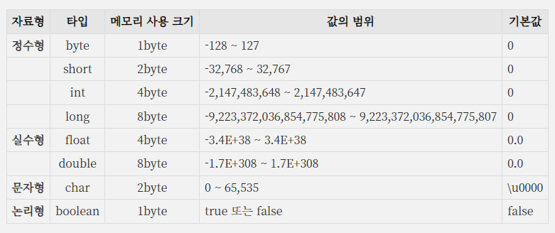
  

  <h5>데이터초기화와 선언</h5>
  
int i = 20; // 초기화  int i; //선언

  
[아스키코드](https://whatisthenext.tistory.com/103)

<h2>배열</h2>
<h5>✔ 배열의 선언과 할당</h5>

  int nums []; // 배열의선언  
  nums = new int[10]; //배열의할당  
  nums는 <u>배열의 주소</u>이고 <strong>[]</strong>는 연산이고 숫자가 들어가서 1칸씩 이동해 값을 가져옴.  

<h5>✔ 배열의 특징</h5>

  배열의 할당 후 값 초기화를 하지 않으면 자료형의 기본값이 들어감  
  int의 기본값 : 0, String의 기본값 : null  
  new 하면은 memory에 공간이 할당!  
  레퍼런스 변수 = 참조 변수  
  ex) 레퍼런스 변수 int Array 선언 => int(배열 타입) intArray(배열에 대한 레퍼런스 변수) ; => int intArray[];  
  ex) 배열생성 intArray(배열에 대한 레퍼런스 변수)  = new(배열생성) int(타입) [5](원소개수); => intArray = new int [5];  
  String str; => 주소를 저장하는 참조변수

<h5>✔ 배열 선언 & 초기화</h5>

  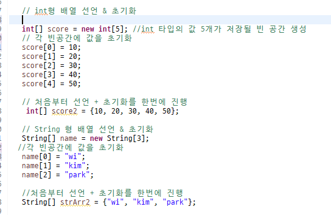

<h2>객체배열</h2>

객체 배열이란,, <u>객체를 저장하는 배열</u>로, 배열의 자료형을 <strong>클래스명(사용자 정의 자료형)</strong>으로 지정하여 활용된다.

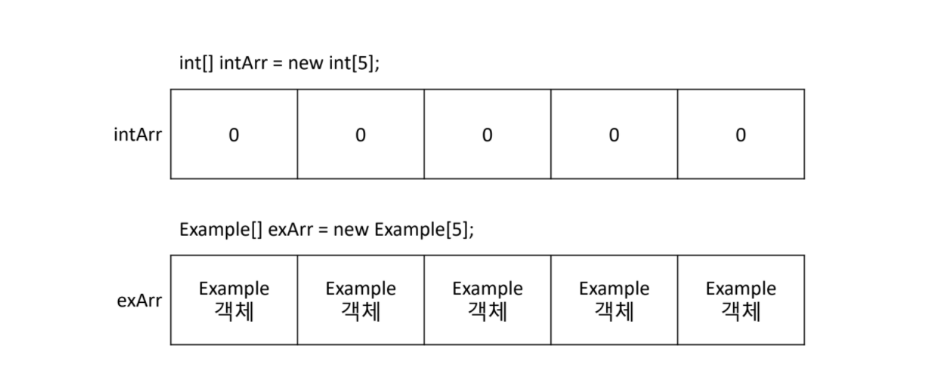

상단의 배열은 일반정수형 배열 변수 intArr을 생성하고, 그 크기는 5만큼 지정해준것이고   하단배열은 정의된 Example객체에 대해 exArr이라는 객체 배열을 생성하고 그 크기는 5만큼 지정해 준것이다. 하나의 객체 자체를 배열의 인덱스로 본것!

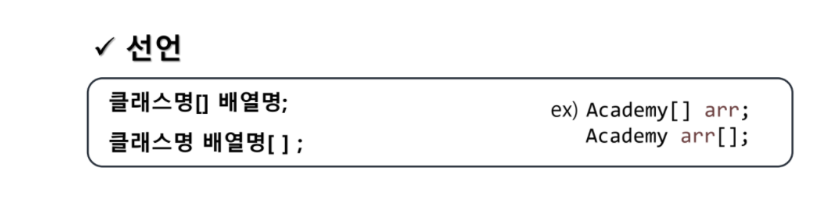

객체배열의 선언은 위와 같고 일반자료형의 선언과 딱히 다른점은 없다. <u>자료형 부분에 클래스명을 적어주는 차이</u>만 있을뿐이다.

  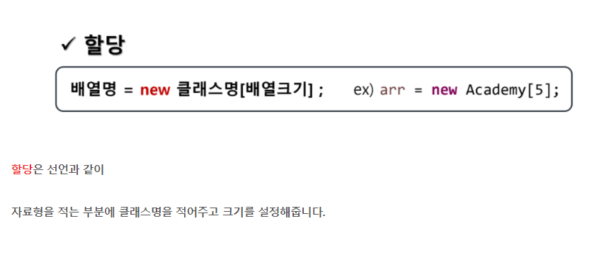 
  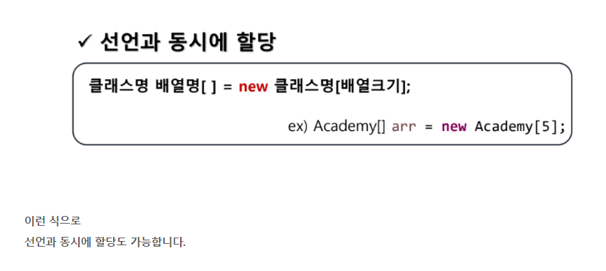 
  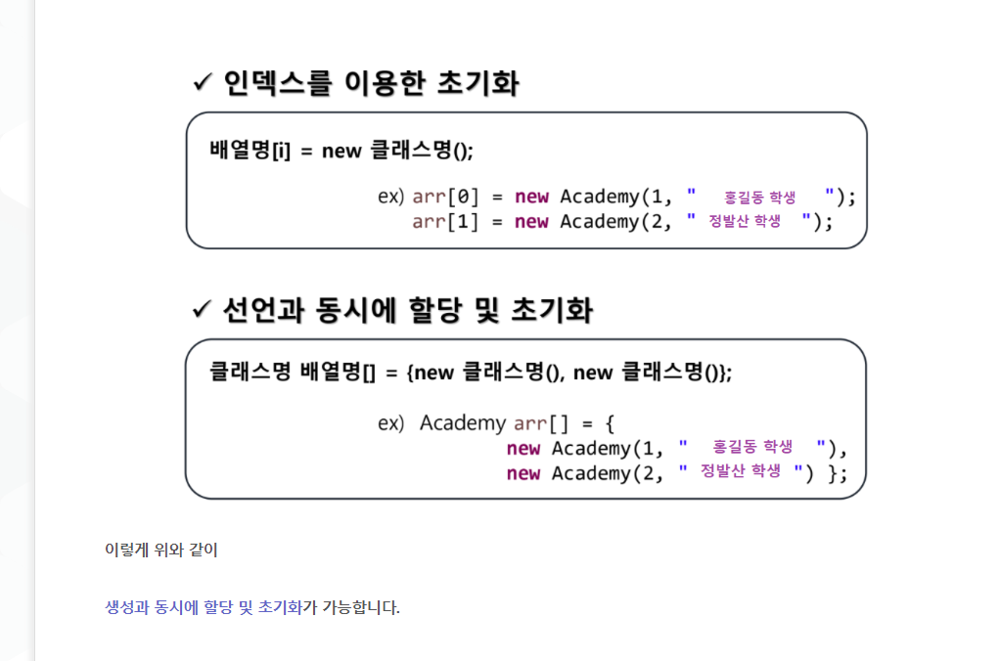

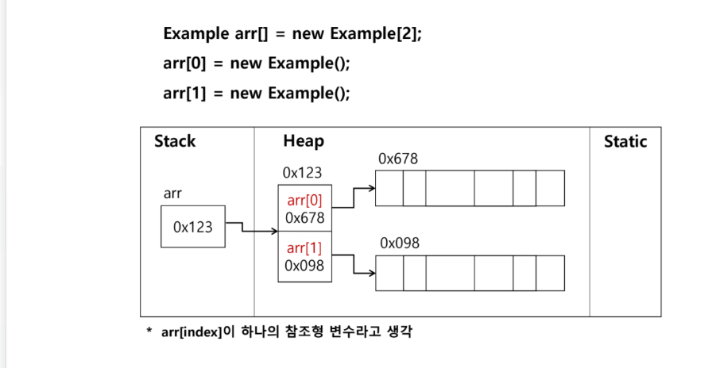

그래서 객체 배열은 메모리상에서 참조가 위 그림처럼 되어있고 일반 배열의 참조와비슷하다 보면된다. 차이점은  일반 배열은 <u>동일한 자료형</u>으로만 이루어져있어 heap에 선언된 자료형 크기로 배열을 이루고 있지만  객체 배열은 다른 자료형들(String, double, int 등등)로 이루어질 수 있기에 각기 다른 자료형 크기로 배열이 이루어져있다.

 <h2>예외처리구문 Try-Catch문</h2>
 <h4>예외처리(Exception)란?</h4>
 
예외는 Error범주에 포함되고 에러는 예외를 포함에 시스템의 이상, 하드웨어의 문제등을 포괄적으로 나타내는 개념이다. 가장 대표적으로 outOfMemoryError를 말할 수 있다. 말 그대로 메모리가 부족해서 시스템이 중단되는것이다.  예외처리란 예외가 발생할 것을 개발자가 미리 예측하새 이를 제어하고 비정상 종료를 피하기 위한 처리방법이다. 자바를 포함한 대부분의 언어들은 이러한 예외상황을 처리하고자 Try Catch문을 사용한다.

 <h4>try catch의 기본적인 구조</h4>
 
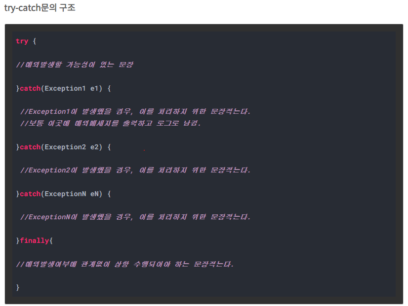

 <h4>Exception은 두 가지 성격으로 나뉩니다.</h4>
 <ul>
  <li>Exception (Checked Exceptions : 반드시 처리해야 하는 예외)</li>
  <li>Runtime Exceptions (반드시 처리해야 하지 않아도 되는 예외)</li>
</ul>
<h4>Java Exception 종류</h4>
  <table>
    <th>예외종류</th>
    <th>에러발생원인</th>
      <tr>
        <td>NullPointException</td>
        <td>참조 에러 (Null 값 참조)</td>
      </tr>
      <tr>
        <td>IOException</td>
        <td>입출력 에러</td>
      </tr>
      <tr>
        <td>OutOfMemoryException</td>
        <td>메모리 부족</td>
      </tr>
      <tr>
        <td>ArithmeticException</td>
        <td>0으로 나눌 경우</td>
      </tr>
      <tr>
        <td>ArrayIndexOfBoundsException</td>
        <td>배열 index 범위 초과</td>
      </tr>
      <tr>
        <td>NumberFormatException</td>
        <td>문자열을 숫자 변환시 발생</td>
      </tr>
      <tr>
        <td>ClassCastException</td>
        <td>클래스 캐스팅 에러</td>
      </tr>
      <tr>
        <td>IllegalArgumentException</td>
        <td>인자 오류</td>
      </tr>
  </table>
  <h4>에러(Error)와 예외(Exception)</h4>
  
Java 에는 에러(Error)와 예외(Exception)이라는 개념이 존재  Java에는 Throwable이라는 클래스존재

  
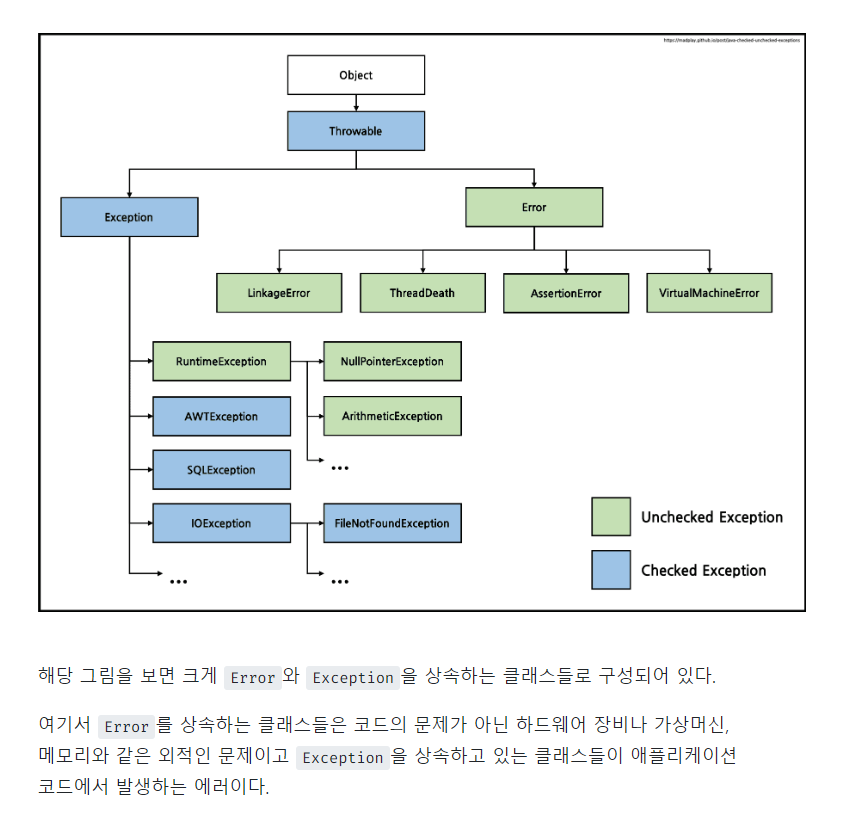

  <h2>Java Stream</h2>
  <h4>배경과목적</h4>
  
FileUpload, Socket 통신 등 다방면에서 Stream API를 사용하게 된다. Stream의 종류를 이해하고 차이를 분석해보자.

  <h4>Stream이란?</h4>
  
Stream은 데이터 입출력 처리의 중간자 역할을 수행함. 그래서 Stream은 입력과 출력이 관련된 곳이면 어디서든 동작한다.

  
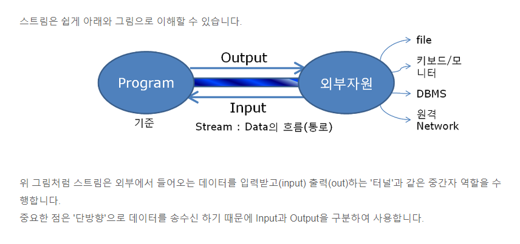

  <h4>Stream의 종류</h4>
  
먼저 Stream은 크게 문자 단위 Stream과 Byte 단위의 Stream으로 나눌 수 있음

  
<strong>- 문자 스트림의 구성도</strong>

  <h5>👀 입력문자 스트림은 <u>Reader</u>라는 단어가 붙어있다.</h5>
  

    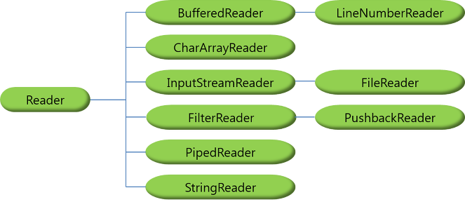 
    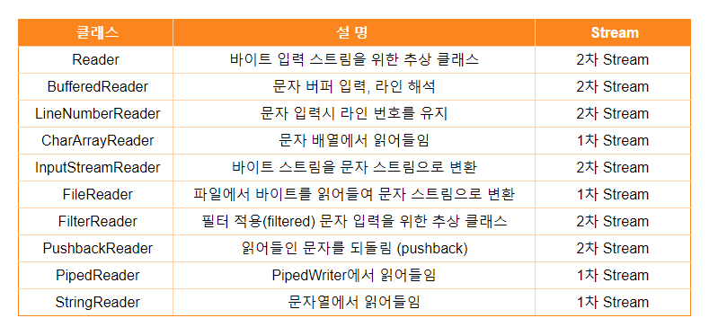
  

  <h5>👀 출력문자 스트림은 <u>Writer</u>라는 단어가 붙어있다.</h5>
  

    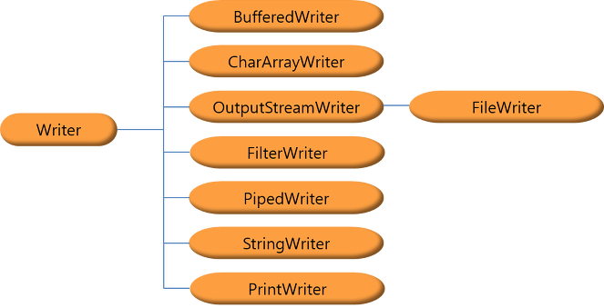 
    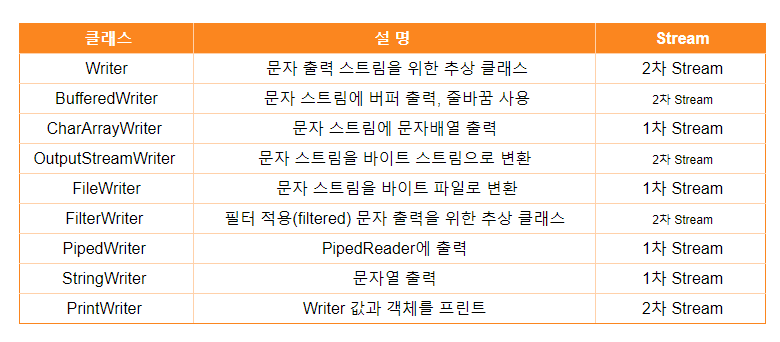
  

  <h5>👀 입력 바이트 스트림 <u>InputStream</u>라는 단어가 붙어있다.</h5>
  

    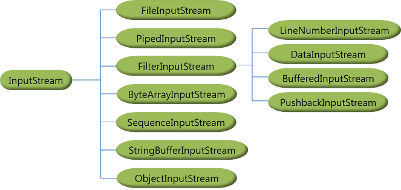 
    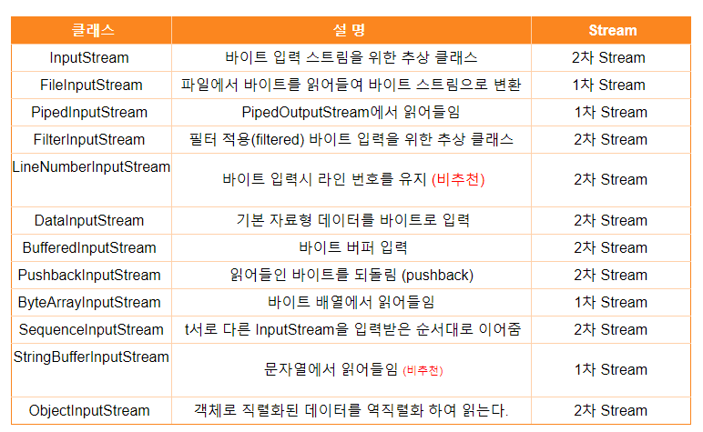
  

  <h5>👀 출력 바이트 스트림 <u>OutputStream</u>라는 단어가 붙어있다.(아닌 것도 있지만 대부분 이 형식에 따름)</h5>
  

    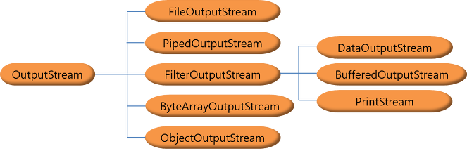 
    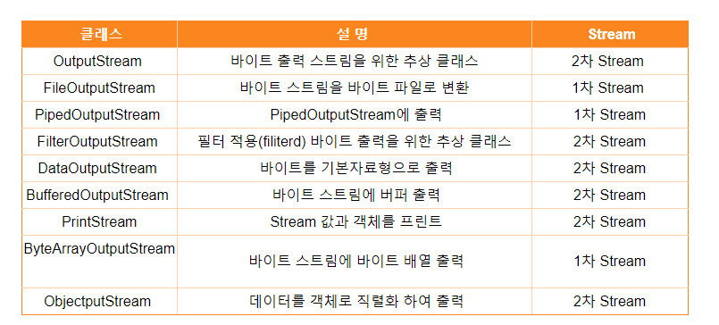
  

  <h2>메소드</h2>
  
서로 연관된 코드를 모아서 이름을 붙이는 정리 정돈의 도구

  

    <h4>💡 메소드 기본형식</h4>
    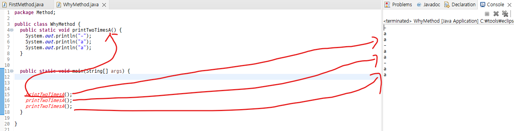
    <h4>💡 메소드 기본형식(Parameter, Argument)</h4>
    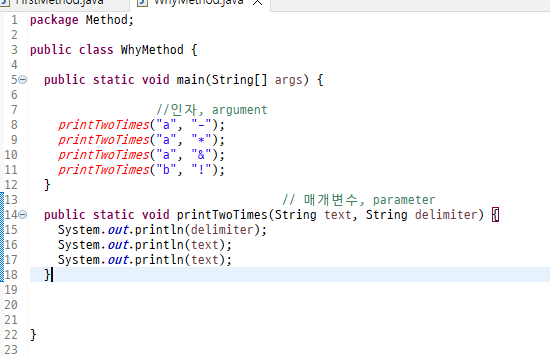
    <h4>💡 메소드 (return) : 메소드의 결과값을 여기저기서 재사용</h4>
    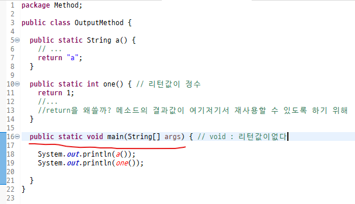
    
<strong>메소드 출력 : </strong>return이가장 중요. 리턴값이 재상용될 수 있게 함.   <strong>public static</strong> 리턴데이터타입 메소드이름 (매개변수타입, 매개변수)   <strong>void : </strong>리턴값이 없음  <strong>return</strong>뒷 값이 출력값

    <h4>💡 메소드의활용(중요)</h4>
    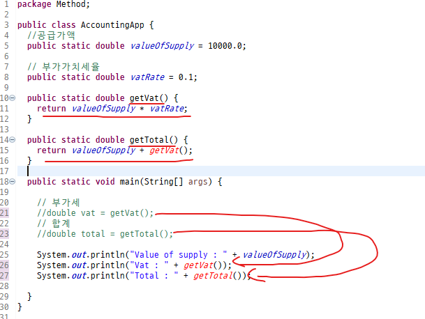
    
-- 메소드명이나 코드를간소화해서 유지보수를 쉽개해준다.

    <h4>💡 Static 정리</h4>
    
Java 에서 Static 키워드를 사용한다는 것은 메모리에 한번 할당되어 프로그램이 종료될 때 해제되는 것을 의미한다. 이를 정확히 이해하기 위해서는 메모리영역에대한 이해가 필요

    

      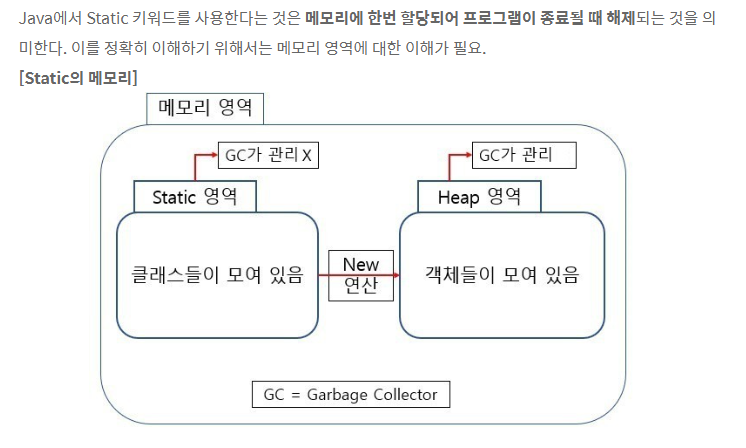 
      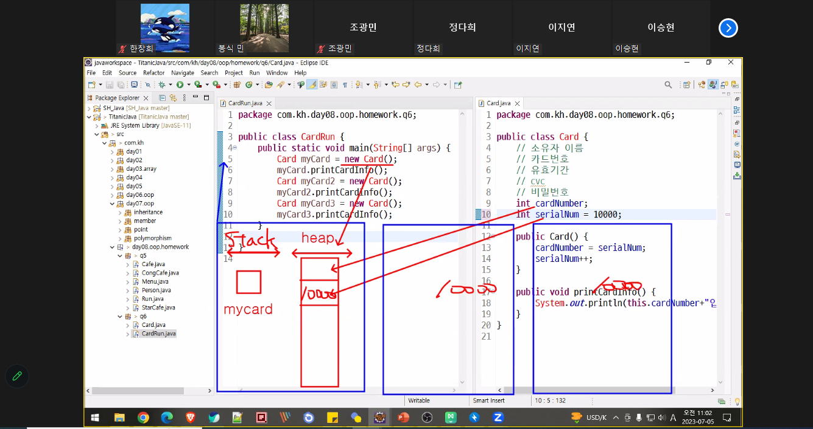
    

    
일반적으로 우리가 만든 Class는 Static 영역에 생성되고, new 연산을 통해 생성한 객체는 Heap영역에 생성됩니다. 객체의 생성시에 할당된 Heap영역의 메모리는 Garbage Collector를 통해 수시로 관리를 받습니다. 하지만 Static 키워드를 통해 Static 영역에 할당된 메모리는 모든 객체가 공유하는 메모리라는 장점을 지니지만, Garbage Collector의 관리 영역 밖에 존재하므로 Static을 자주 사용하면 프로그램의 종료시까지 메모리가 할당된 채로 존재하므로 자주 사용하게 되면 시스템의 퍼포먼스에 악영향을 주게 됩니다.

    

      

        <strong><em>static - class method</em></strong>  (✨클래스의 소속✨) 
        <strong><em>no static - instance method</em></strong>  (✨인스턴스의 소속✨)
      

      <h3>👌 [Static] 변수 특징</h3>
      <ul>
        <li>Static 변수는 클래스 변수이다.</li>
        <li>객체를 생성하지 않고도 Static 자원에 접근이 가능하다.</li>
      </ul>
      
Static 변수와 Static 메소드는 Static 메모리 영역에 존재하므로 객체가 생성되기 이전에 이미 할당되어있다. 그렇기 때문에 객체의 생성없이 바로 접근(사용)할 수 있다.

      

        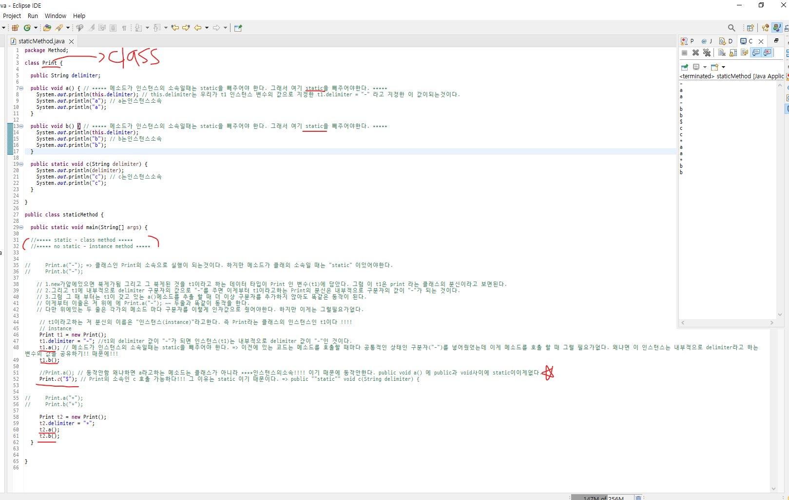
      

      <h3>👌 Static 변수(정적 변수)</h3>
      
메모리에 고정적으로 할당되어, 프로그램이 종료될 때 해제되는 변수

      <h3>👌 Static 메소드(정적 메소드)</h3>
      
Static Method는 객체의 생성 없이 호출이 가능하며, 객체에서는 호출이 가능은 하지만 지양한다. 일반적으로는 유틸리티 관련 함수들은 여러 번 사용되므로 static 메소드로 구현을 하는 것이 적합한데, static 메소드를 사용하는 대표적인 Util Class로는 <strong>java.util.Math</strong>가 있다.

    

  

  <h2>✨객체지향 프로그래밍✨</h2>
  
객체지향 프로그래밍(Object-Oriented Programming)이란 프로그램을 설계하는 개념이자 방법론이다.   줄여서 OOP라 부르며, 단어 뜻 그대로 프로그램(실제세계)를 객체(사물)라는 기본 단위로 나누고 이 객체들간의 상호작용을 기본 개념으로 한다.

  <h3>객체지향의 특징 4가지(추상화, 캡슐화, 상속, 다형성)</h3>
  <h3>1.추상화(Abstraction)</h3>
  
예를들어, 람보르기니와 페라리 2대의 차를 보았을때 각 차에는 핸들, 바퀴, 문, 창문 등의  요소를 가지고 있는 것을 알 수 있다. 이렇게 람보르기니와 페라리는 서로 다른  객체이지만 공통된 특징과 기능을 지니고 있다. 이런 공통점을 모아 하나의 '자동차'라는 범주, 즉 <strong><u>'클래스'</u></strong>로 묶을 수 있다.

  <h4>추상클래스(Abstract Class)와 인터페이스(InterFace)의 특징 및 차이점 알아보기</h4>
  <table>
    <th colspan="2">구분</th>
    <th>추상 클래스</th>
    <th>인터페이스</th>
      <tr>
        <td rowspan="3"><strong>공통점</strong></td>
        <td>객체생성</td>
        <td colspan="2">객체를 생성(인스턴스화)할 수 없다.</td>
      </tr>
      <tr>
        <td>추상메서드</td>
        <td colspan="2">추상 메서드를 포함한다.</td>
      </tr>
      <tr>
        <td>기능적 목적</td>
        <td colspan="2">상속받은 클래스에서는 추상 메서드를 반드시 재정의하여 구현해야 한다.</td>
      </tr>
      <tr>
        <td rowspan="6"><strong>차이점</strong></td>
        <td>개념적 목적</td>
        <td>상속 받아서 <strong>기능을 확장</strong>시키는데 목적</td>
        <td>구현 객체의 <strong>동일한 실행 기능을 보장</strong> 하기 위한 목적</td>
      </tr>
      <tr>
        <td>클래스</td>
        <td>클래스다.(abstract class)</td>
        <td>클래스가 아니다.(interface)</td>
      </tr>
      <tr>
        <td>일반메서드</td>
        <td>일반 메서드 정의가 가능</td>
        <td>일반 메서드 정의 불가능  (Java8 이후 static,default 메서드 정의  가능)</td>
      </tr>
      <tr>
        <td>멤버 변수</td>
        <td>클래스와 동일하게 변수 선언 및 사용 가능</td>
        <td>상수만 사용 가능</td>
      </tr>
      <tr>
        <td>상속키워드</td>
        <td>extends</td>
        <td>implements</td>
      </tr>
      <tr>
        <td>다중상속</td>
        <td>불가능</td>
        <td>가능</td>
      </tr>
  </table>
<h4>👌 왜헷갈리는걸까?</h4>

추상클래스와 인터페이스 모두 "추상 메서드" 라는 내용에 대한 구현이 없는 선언부만 가지고 있는 메서드를 가지고 있으며 <strong>"독립적으로 객체를 생성할 수 없다"</strong>는 공통점이 있다.  사용하는 목적에 있어서도 추상클래스나 인터페이스 모두 <strong>여러 곳에서 사용될 공통된 기능에 대한 구현을 강제하기 위한 기능을 하고있다.</strong>

<h4>👌 그렇다면, 차이점은?</h4>

헷갈리지 않기 위해 차이점을 알아보면   추상 클래스는 <strong><em>extends,</em></strong>인터페이스는 <strong><em>implements</em></strong>상속 키워드를 사용한다.  각 단어를 사전적으로 설명하면 다음과같다.

<strong>extends:</strong>확대[확장] 하다   <strong>implements:</strong>시행하다, 실행하다

개념적 차이점이 아닌 실제 적용하는 것에서 차이점을 생각해보면,   추상클래스는 extends(<strong>기능확장</strong>)의 느낌 키워드 그대로 <strong>자신의 기능들을 하위로 확장시키는 것!</strong>으로 볼 수 있다.

인터페이스는 implements(<strong>실행하는 기능 구현</strong>의 느낌) 키워드처럼 인터페이스에 정의된 메서드를 각 클래스의 목적에 맞게 동일한 기능으로 구현하는 것으로 볼 수 있습니다.

  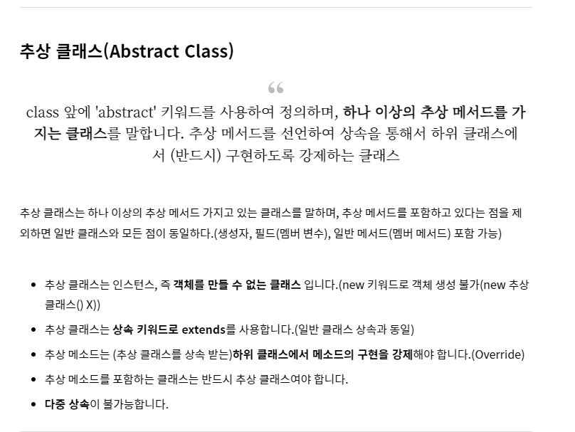 
  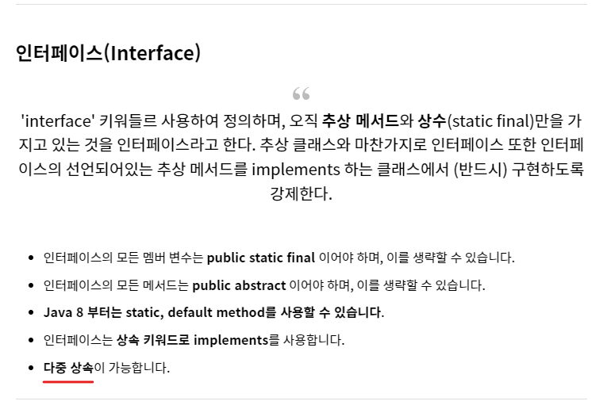 
  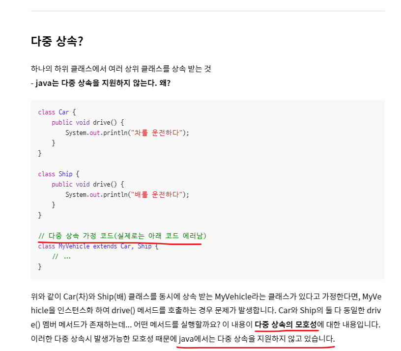 
  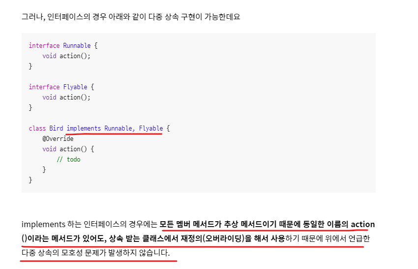 

<h3>2.캡슐화(은닉화)(Encapsulation)</h3>

캡슐화는 연관있는 변수와 메소드를 묶어주는 작업을 말한다.   접근 제어 지시자<strong>[public, private, protected]</strong>를 통해 외부로부터의 접근을 제한하여 객체내에서만 접근이 가능하도록 해준며, 이를 정보은닉이라 한다.
외부의 클래스 혹은 모듈에 의존적인 프로그램의 경우 변경이나 오류에 취약해지는데, 정보은닉을 통해 이러한 결합도를 낮추며 응집도를 높여준다.

<h4>💡 접근 지정자, 접근 제한자</h4>

접근지정자는 객체지향의 4대 개념(추상화, 캡슐화, 상속, 다형성)에서 캡슐화와 관련되어 있다. 좀 더 정확이 이야기하자면 캡슐화라는 개념이 포함되고 있는 <strong>"은닉화"</strong>와 밀접한 관련이 있다고 볼 수 있다.

<h5>public, protected, default, private 의 4종류가 있고   접근가능범위는 public > protected > default > privte 순이다.</h5>

  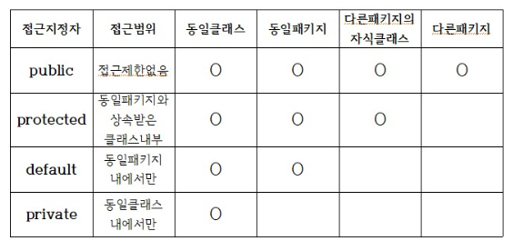

<h4>💡 접근제한자</h4>

  🎉 클래스(객체) 멤버에 대한 접근을 제한하는 키워드 
  🎉 private: 클래스 내부에서만 직접 접근이 가능 
  🎉 public: 어디서든 접근이 가능 
  🎉 protected: default + 상속 관계일 때 직접 접근 가능 
  🎉 default(선언없음): 동일한 패키지 범위까지 접근 가능

<h4>💡 private 멤버에 대한 접근이 가능하도록 해주는 메서드</h4>

  <strong><em>setter : </em></strong> 값을 설정하는 메서드  
  <strong><em>getter : </em></strong> 값을 반환하는 메서드

  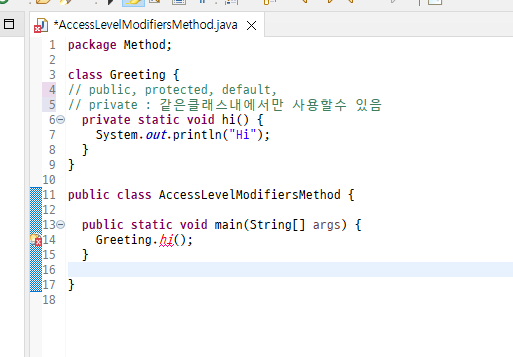
  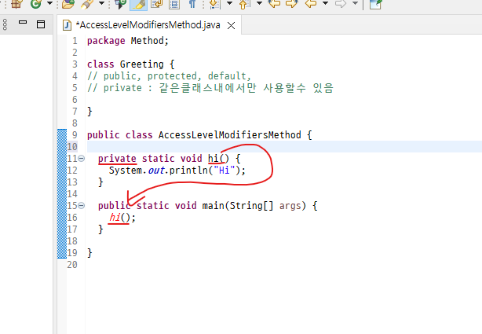

<strong><em>✔ private오류예시설명 : </em></strong> 같은클래스내에서만 사용할수있음. 위에그림에서 Greeting 클래스와 AccessLevelModifiersMethod 클래스는 다른클래스범위이기때문에 14번째줄에서 에러발생! hi() 메서드는 에러발생! 그래서 같은 클래스 AccessLevelModifiersMethod 영역으로 옮겨야 정상실행가능

<h3>3.상속(Inheritance)</h3>

클래스 개념이 도입되면서 상속을 통해 부모클래스의 속성과 기능을 이어받아(상속받아) 사용하는 것을 말한다.  프로그램을 개발하다보면 중복되는 속성과 기능을 개발해야하는 일이 발생되는데 상속을 사용한다면 중복되는 기능을 반복하여 작업하지 않고 작업을 할 수 있게 해준다.  
- 자식클래스는 상속을 통해 부모클래스의 속성과 기능을 물려받는다.  
- 또한, 다형성을 통해 변경이 필요한 부분을 변경하여 사용할 수 있다.

  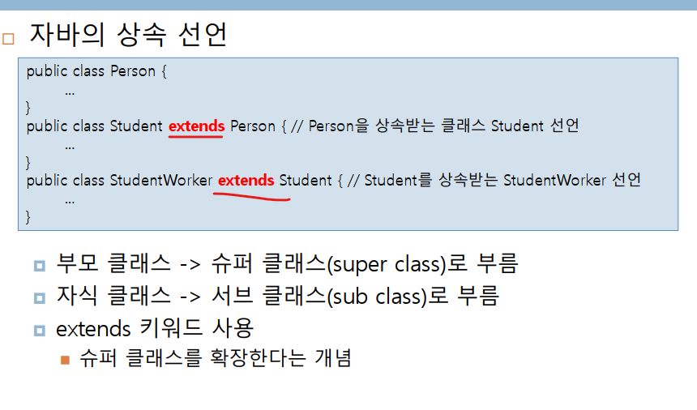

<h3>4.다형성(Polymorphism)</h3>

다형성이란 프로그래밍 언어의 자료형 체계의 성질을 나타내는 것으로, 동일한 변수, 함수명 등이 다양한 방법으로 기능하는 것을 말하며 <strong>오버라이딩(Overriding), 오버로딩(Overloading)</strong>이란 형태로 제공된다.  
[오버로딩 & 오버라이딩링크](https://hyoje420.tistory.com/14)

<strong><em>✨✨ 오버라이딩(Overriding) ✨✨ : </em></strong>상속받은 메소드를 재정의 하는 것

부모 클래스로부터 상속받은 메소드를 자식 클래스에서 <strong>재정의</strong>하는 것을 오버라이딩이라고 한다. 상속받은 메소드를 그대로 사용할 수도 있지만, 자식 클래스에서 상황에 맞게 변경해야 하는 경우 오버라이딩 할 필요가있다.

✔ 오버라이딩의 조건 : 오버라이딩은 부모 클래스의 메소드를 재정의 하는 것이므로, 자식 클래스에서는 <strong>오버라이딩하고자 하는 메소드의 이름, 매개변수, 리턴 값이 모두 같아야 한다.</strong>

<strong>😜 바인딩이란?</strong>

실제 실행할 메소드 코드와 호출하는 코드를 연결시키는 것을 바인딩이라함! 프로그램이 실행되기 전에 컴파일이 되면서 모든 메서드는 정적 바인딩된다.

<strong>😜 동적바인딩이란?</strong>

컴파일 시 정적바인딩된 메서드를 실행할 당시의 객체 타입을 기준으로 바인딩 되는 것을 동적바인딩 이라한다!

<strong>👀 동적바인딩성립요건 👀</strong>

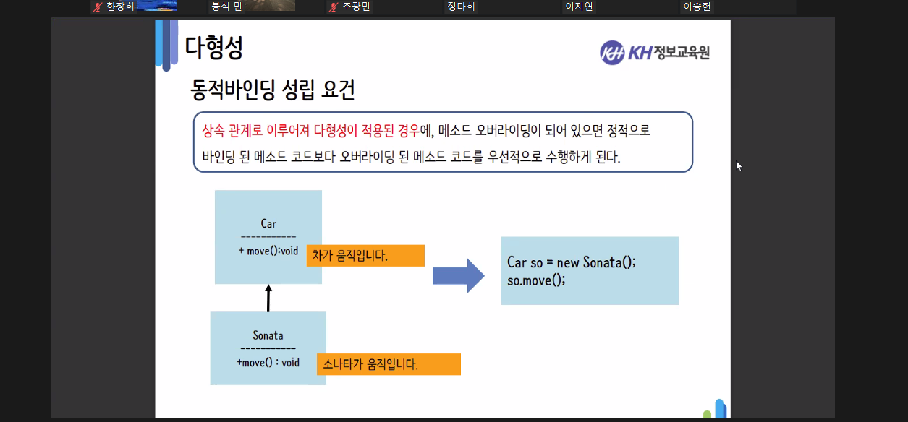

<strong><em>✨✨ 오버로딩(Overloading) ✨✨ : </em></strong>기존에 없는 새로운 메소드를 추가하는 것

오버로딩(Overloading)이라는 뜻은 사전적으로 '과적하다.' 라는 뜻이다. C언어에서는 함수명이 고유하게 존재해야 한다. 즉 하나의 함수가 하나의 기능만을 구현해야한다는 것이다   그러나 자바에서는 하나의 메소드 이름으로 여러 기능을 구현하기 때문에 '과적하다.'라는 뜻의 이름을 붙여준 것으로 보인다.   오버로딩의 정의는 <strong>자바의 한 클래스 내에 이미 사용하려는 이름과 같은 이름을 가진 메소드가 있더라도 매개변수의 개수 또는 타입이 다르면,같은 이름을 사용해서 메소드를 정의할 수 있다.</strong>

✔ 오버로딩의 조건 : <strong>메소드의 이름이 같고, 매개변수의 개수나 타입이 달라야 한다.</strong> 주의할점은 <strong>'리턴값만' 다른 것은 오버로딩을 할 수 없다는 것이다.</strong>

오버로딩 ex)  
System.out.println("") : 문자 
System.out.println(431) : 숫자 
내가 주는 인자에따라 println이 여러가지 형태로 동작한다!!

<h5>오버로딩 vs 오버라이딩 구분</h5>
  <table>
    <th>구분</th>
    <th>오버라이딩(OverRiding)</th>
    <th>오버로딩(OverLoading)</th>
      <tr>
        <td>접근 제어자</td>
        <td>부모 클래스의 메소드의 접근 제어자보다  <strong>더 넓은 범위의 접근 제어자</strong>를  자식 클래스의 메소드에서 설정할 수 있다.</td>
        <td>모든 접근 제어자를 사용할 수 있다.</td>
      </tr>
      <tr>
        <td>리턴형</td>
        <td>동일해야 한다.</td>
        <td>달라도 된다.</td>
      </tr>
      <tr>
        <td>메소드명</td>
        <td>동일해야 한다.</td>
        <td>동일해야 한다.</td>
      </tr>
      <tr>
        <td>매개변수</td>
        <td>동일해야 한다.</td>
        <td>무조건!! 달라야한다.</td>
      </tr>
      <tr>
        <td>적용 범위</td>
        <td><strong><u>상속관계</u></strong>에서 적용된다.</td>
        <td><strong><u>같은 클래스</u></strong>내에서 적용된다.</td>
      </tr>
  </table>
  <h2>💡 Java Class 구성</h2>
  <ul>
    <li>Member Field (클래스묶여서이루어짐 Member Field + Member Method)</li>
    <li>Member Method (클래스묶여서이루어짐 Member Field + Member Method)</li>
    <li>Constructor (생성자)</li>
    <li>Access Modifiers (접근제어자)</li>
    <li>Garbage Collection (객체를관리)</li>
  </ul>
  <h3>Class(클래스), 객체(Object) Instance(객체), Constructor(생성자)</h3>
  
<strong>✔ 클래스(class)란?</strong> Java에서 객체를 생성하기 위한 일종의 <u>설계도</u> 이다.  객체가 가지는 속성(필드)와 동작(메서드)으로 이루어져 있다.  Java를 실행시 클래스는 <u>JVM 메모리의 클래스 영역(Class Area)에 로드</u>된다.

  
<strong>✔ 객체(Object)란?</strong> 물리적으로 존재하거나 추상적으로 생각할 수 있는 것 중에서   <u>자신의 속성을 가지고 있고, 다른 것과 식별 가능한 것을 말한다.</u>

  
<strong>✔ 인스턴스(Instance)란?</strong> 물리적으로 존재하거나 추상적으로 생각할 수 있는 것 중에서   <u>자신의 속성을 가지고 있고, 다른 것과 식별 가능한 것을 말한다.</u>

  

    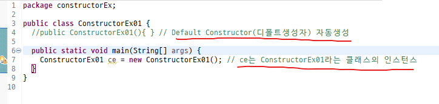
  

  <h4>클래스 구조</h4>
  <table>
    <th>클래스와 구성 멤버</th>
    <th>설명</th>
      <tr>
        <td>필드(Field)</td>
        <td>객체의 데이터가 저장되는 곳</td>
      </tr>
      <tr>
        <td>생성자(Constructor)</td>
        <td>new 연산자로 호출되는 메소드로 객체 생성 시 필드의 초기화를 담당</td>
      </tr>
      <tr>
        <td>메소드(Method)</td>
        <td>객체의 동작에 해당하며 클래스의 다양한 동작을 구성</td>
      </tr>
  </table>
  
클래스 내부에는 클래스의 속성을 나타내는 필드와 클래스의 동작을 나타내는 메소드 그리고 클래스를 생성할 때 호출할 수 있는 생성자가 있다. 생성자는 new 연산자를 통해 호출할 수 있는 메소드라고 생각하면되고 <strong><u>주로 필드의 변수들을 초기화</u></strong>하는 역할을 한다.

  

    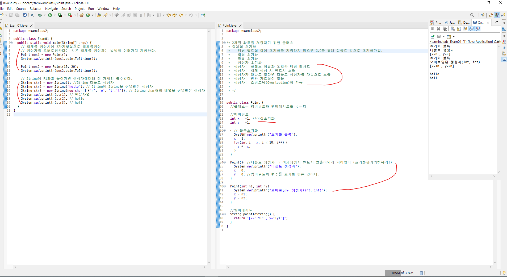
  

  
사진처럼 클래스는 멤버필드와 멤버변수를 갖는다.

  

    객체의 초기화  
    * 멤버 필드의 값에 초기화를 지정하지 않는다면 G.C(가비지콜렉터)를 통해 디폴트 값으로 초기화가됨.  
    직접초기화 , 블록초기화 , 생성자 초기화(제일 많이씀)
  

  

    ✨ 생성자는 클래스 이름과 동일한 멤버 메서드  
    ✨ 생성자는 객체 생성 시 반드시 호출  
    ✨ 생성자가 하나도 없다면 디폴트 생성자를 자동으로 호출  
    ✨ 생성자는 반환 자료형이 없음  
    ✨ 생성자는 오버로딩(OverLoading)이 가능
  

  <h2>💡 Java This(중요) - 자기자신을 참조한다.</h2>
  

    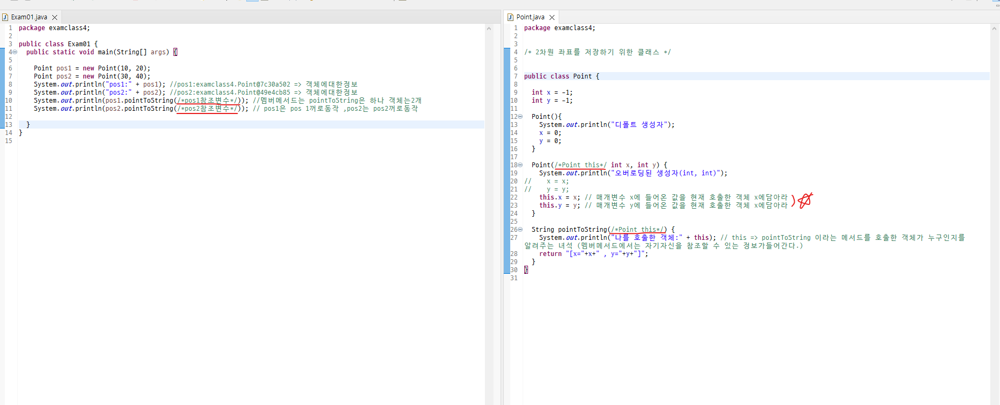
    
✨✨왼쪽 부분에서 밑줄친 부분은 멤버메서드를 호출할 때 pos1참조변수가 넘어간다.(내부적으로 동작)

    
✨✨오른쪽 부분에서 밑줄 친 부분은 //자기자신을 참조할 수 있는 this라는 참조변수가 선언되엇다고볼 수 있다.(이것으로 각 객체를 구분한다는 것이다.)

  

  

    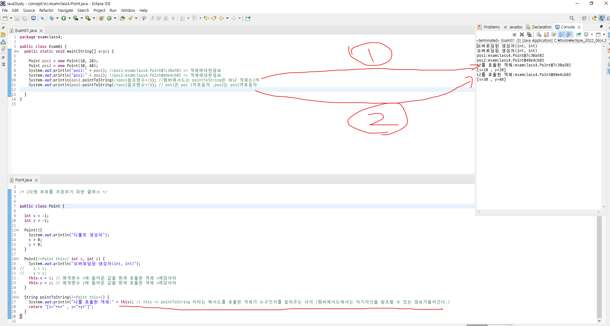
    
✨하여 출력결과는 위쪽의 이미지와 같이 각 객체가 다른 객체(pos1, pos2)를 참조해서 각각 다른 객체의 주소와 this를 활용해 값이 저렇게 다르게 하나의 메서드를 이용해 객체2개에 대한 값을 출력해 주는 것을 볼 수 있다.

  
