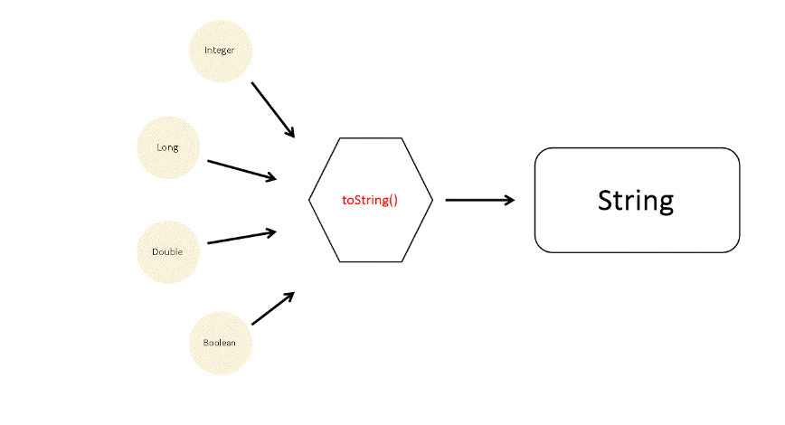
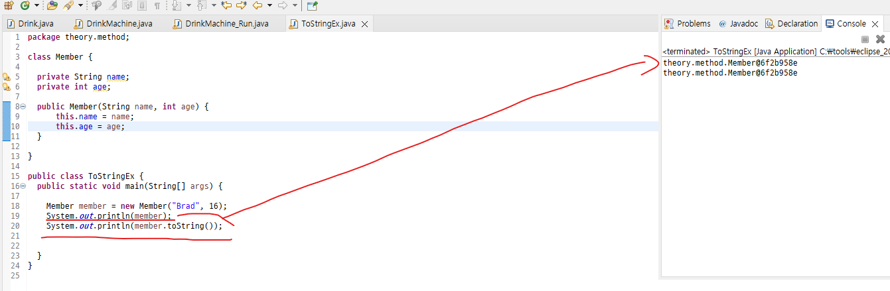
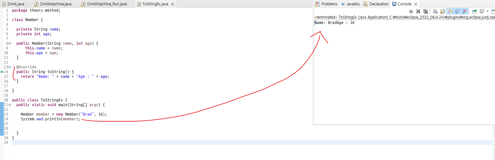
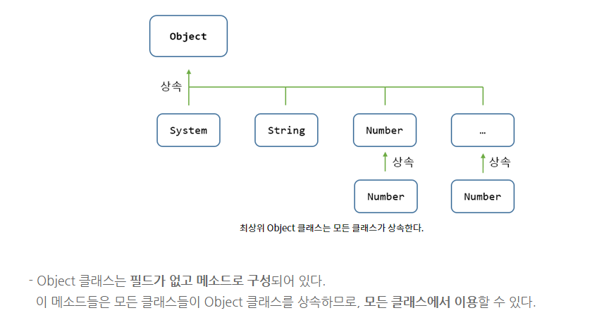

# Java 객체(Object), 메서드(Method) 정리

<h2>Scanner</h2>

자바를 처음 배울 때 콘솔에서 키보드 값을 입력받을 때 가장 많이 사용하는 클래스

<h3>Scanner 클래스의 특징</h3>
<ul>
  <li>java.util 패키지에 포함되어 있어 java.util을 import 해줘야 사용될 수 있다.</li>
  <li>기본적인 데이터 타입을 모두 입력받을 수 있다.</li>
  <li>토큰(공백, 개행, 탭)을 기준으로 데이터를 입력받는다.</li>
</ul>
<h3>Scanner 클래스 사용법</h3>
<h4>Scanner 사용 순서</h4>
<h5>1.Scanner는 java.util에 되어 있어 import를 해줘야 사용할 수 있다. java.util.scanner만 import해도 되고 *를 활용하여 util의 모든 클래스를 import해도된다.</h5>

  <strong>import</strong> java.util.Scanner; // java.util의 Scanner 클래스 import  
  <strong>import</strong> java.util.*; // java.util에 있는 클래스 모두 import

<h5>2.Scanner 객체를 생성한다. 클래스명은 주로 sc로 많이 네이밍하고 생성하면된다. new는 새로운 객체를 heap 메모리에 할당하겠다는 의미이고 System.in은 화면에서 입력을 받겠다는 의미이다. System.in은 입력한 값을 Byte 단위로 읽어주는 자바의 표준 입력 스트림이다.</h5>

<strong>Scanner</strong> sc = new <strong>Scanner</strong> (System.in); //Scanner 객체생성

<h5>Scanner 객체를 사용하여 입력값을 받는다. 참고로 입력받을 데이터 타입에 의해 Scanner 클래스의 메서드를 달리해야 한다.</h5>

String str = sc.next(); //입력받은 문자열을 str에 저장

<h4>Scanner 클래스의 메서드</h4>

토큰(Token) : 공백 문자(Spacebar), 탭(Tab), 개행(Enter) 등으로 구분되는 요소

<table>
  <tr>
    <th>메소드</th>
    <th>설명</th>
      <tr>
        <td>next()</td>
        <td>String을 읽음, 토큰(Token)을 기준으로 읽음. 스페이스 즉 공백전까지 입력받은 문자열 리턴한다.</td>
      </tr>
      <tr>
        <td>nextLine()</td>
        <td>String을 읽음, 개행(Enter)을 기준으로 읽음. Enter를 치기 전까지 쓴 문자열을 모두 리턴한다.</td>
      </tr>
      <tr>
        <td>nextInt()</td>
        <td>int를 읽음.</td>
      </tr>
      <tr>
        <td>nextBoolean()</td>
        <td>boolean을 읽음</td>
      </tr>
      <tr>
        <td>nextByte()</td>
        <td>byte를 읽음.</td>
      </tr>
      <tr>
        <td>nextShort()</td>
        <td>short를 읽음.</td>
      </tr>
      <tr>
        <td>nextLong()</td>
        <td>long을 읽음.</td>
      </tr>
      <tr>
        <td>nextFloat()</td>
        <td>float을 읽음.</td>
      </tr>
      <tr>
        <td>nextDouble()</td>
        <td>double을 읽음.</td>
      </tr>
  </tr>
  </table>

<h2>toString() 메소드</h2>

Object는 모든 클래스의 부모 클래스이다. 개발자가 생성한 어떤 클래스도 Object 클래스를 자동으로 상속하기 때문에 Object 클래스의 메소드를 사용할 수 있는 것이다.  그중에서 toString() 메소드는 객체를 문자열로 리턴하는 메소드이다. 그리고 가장 많이 사용하는 메소드이다!

<h4>👀 toString() 메소드는 어떻게 출력될가?</h4>

예시로 사용할 Member 클래스를 간단하게 정의했고 name,age를 인자로 가지는 생성자를 구현할 수 있도록 했다. 그리고 ToStringEx 메소드에 Member 클래스의 인스턴스를 생성한 후 <u>System.out.println()</u> 메소드를 통해 객체만 출력했을 경우와 객체에 toString() 메소드를 적용했을 경우 출력값의 차이는 없다.

<blockquote>System.out.println(member); -- 객체만 출력했을 경우 System.out.println(member.toString()); --toStringEx 메소드</blockquote>

객체와 toString() 메소드를 적용한것은 동일하다.  기본적으로 <u>PrintStream</u> 클래스의 출력 관련 메소드(print, println)를 통해 객체를 출력하도록 명령하면 자바 컴파일러가 내부적으로 toString() 메소드를 호출한다. 굳이 <strong><em>객체.toString</em></strong> 형태를 가질 필요가 없다!

<h4>👀 toString() 의 결과값을 원하는 대로 재정의</h4>

<strong>통합 개발 환경(IDE:Integrated Development Environment)</strong>을 사용한다면 기본적으로 메서드 오버라이딩 기능을 지원하기 때문에 쉽게 메서드 재정의 작업을 할 수 있다. 위와같이 Member클래스에 toString() 메소드를 원하는 방향으로 재정의를 하였다!  그리고 main 메서드에서 Member 클래스 인스턴스 생성 후 출력하도록 구현하였다. 자바는 객체 출력시 자동으로 toString() 메소드를 호출한다는 사실을 알았기 때문에 <strong>객체.toString</strong>과 같은 형태를 더이상 사용하지는 않는다.

<h2>Object 클래스</h2>

자바의 클래스를 선언할 때 extends 키워드로 다른클래스를 상속하지 않으면 암시적으로 <strong>java.lang.Object 클래스를 상속</strong>하게 된다. 따라서 자바의 클래스는 Object 클래스의 자식이거나 자손클래스가 된다. 즉 Object는 자바의 최상위 부모 클래스에 해당된다.

<h3>Object 클래스의 메소드들</h3>
<h4>✔ 객체 비교 equals()</h4>

-매개타입 : Object로 모든 객체가 매개 값으로 대입될 수 있다.   - 리턴 타입: boolean 두 객체가 동일한 객체라면 true, 그렇지 않으면 false를 리턴한다.

<h4>✔ 객체 해쉬코드 hashCode()</h4>

객체 해시코드 : 객체를 식별할 하나의 정수값  Object의 hashCode() 메소드는 객체의 메모리 번지를 이용해서 해시코드를 만들어서 리턴한다. 따라서 객체마다 다른 값을 가지고 있다.

<h4>✔ 객체 문자 정보 toString()</h4>

Object클래스의 toString() 메소드는 객체의 문자 정보를 리턴한다.  객체 문자 정보 : 객체를 문자열로 표현한 값 기본적으로 Object 클래스의 toString() 메소드는 '클래스명@16진수해시코드'로 구성된 문자 정보를 리턴

