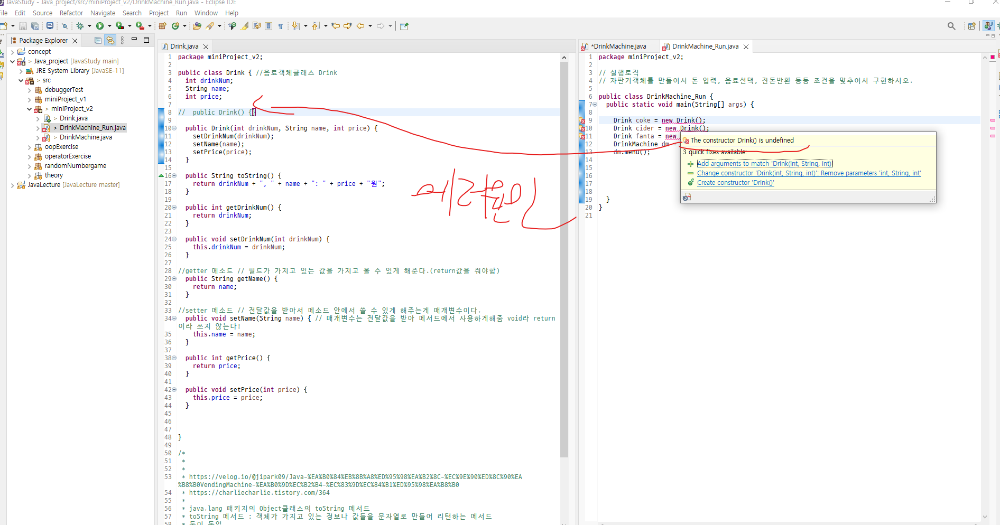

# Java Error 정리

<h2>🎉 에러메시지 : The constructor Drink() is undefined</h2>

위에 사진에서 생성자가 정의되지 않았다는것인데 그 말은 즉슨 지금  <strong><u>Drink(int drinkNum, String name, int price)</u></strong> => 매개변수가있는 생성자가 생성되있지만 오른쪽 Drink객체 부분에서는 매개변수가없으니 디폴트생성자로 참조되있다고 보면 된다. 그래서 저렇게 매개변수가 있는 생성자를 쓰려고 하면 혹시모르니 디폴트생성자도 미리 하나 만들어 주는 것이 좋을 것 같다!

